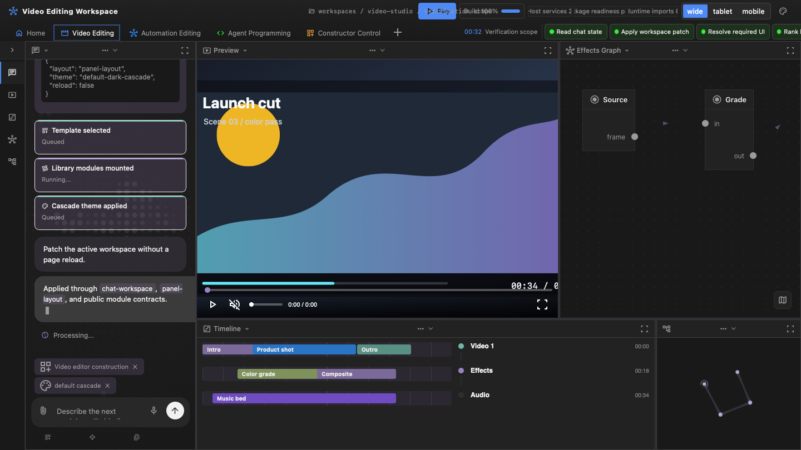

[](https://www.npmjs.com/package/symbiote-workspace) [](https://opensource.org/licenses/MIT) [](https://nodejs.org) [](https://developer.mozilla.org/en-US/docs/Web/JavaScript/Guide/Modules)

# symbiote-workspace

**symbiote-workspace turns chat intent into portable, executable Symbiote
workspaces. Fast.**

Build professional agent workspaces from plain JSON configs: views, layouts,
panels, modules, actions, wires, Cascade themes, plugin metadata, runtime
slots, host requirements, and browser assembly. The package
gives agents a direct path from user intent to a relaunchable workspace without
forking a product app, hardcoding a host, or generating one-off UI code first.



## Why symbiote-workspace?

- **One artifact for the whole workspace** — layouts, modules, theme, wires,
  host requirements, and validation reports live in portable JSON.
- **Agent construction without free-form app forks** — classify intent, ask the
  construction questions, select modules, validate the result, and assemble it
  in the browser.
- **Symbiote primitives first** — use `symbiote-ui` layouts, Web Components,
  Cascade theme, manifests, and plugin descriptors before creating new modules.
- **Same tools over CLI and MCP** — every registered tool goes through one
  dispatch registry, so local scripts and agent hosts see the same behavior.
- **Relaunchable by any compatible host** — exported configs exclude auth,
  secrets, user identity, local paths, and product-only runtime state.

## What is Symbiote Workspace?

Symbiote Workspace is the portable construction layer between provider UI
primitives and host applications. The host supplies chat, model routing, auth,
policy, secrets, storage, billing, and identity. `symbiote-workspace` supplies
the schema, constructor, plugin registry, config mutation tools, validation,
sharing contract, browser mounting, CLI, MCP transport, and optional server
mode.

> **Learn more**: [Host Contracts and Construction Protocol](./docs/host-contracts.md)

## Key Features

### Guided Workspace Construction

- **Construction protocol** — intent classification, questionnaire state,
  topology planning, module selection, execution model, host services, and
  package readiness.
- **Capability-driven modules** — module descriptors materialize panel types,
  actions, menus, toolbars, settings, events, slots, state fields, and wires
  into executable workspace surfaces.
- **Template and plugin inputs** — canonical templates and plugin-provided
  workspace templates feed the same planner instead of creating product forks.

### Portable Config Runtime

- **Strict export/import** — shareable workspace JSON strips host-only state and
  rejects auth, user identity, server URLs, local paths, and session data.
- **Host integration contracts** — exported metadata tells a compatible host
  which imports, components, services, runtime slots, and permissions are
  required to relaunch the workspace.
- **No-reload browser updates** — mounted workspaces can apply validated config
  updates and patches without replacing the browser runtime.
- **Portable media evidence** — versioned media evidence manifests bind a
  content-addressed artifact DAG to render metrics, provenance, quality gates,
  and a fail-closed publication verdict without storing host paths or secrets.
  The v3 identity binds an optional virtual sequence into the canonical manifest
  id, backed by a `workspace-media-artifact-graph-v2` `virtual-sequence` node
  that a passing publication proof must transitively depend on. See
  [Media Evidence and Artifact Invalidation](./docs/media-evidence.md).
- **Portable virtual media sequence** — an indexed playback model with a required
  `executionTier`, carrying encoded master segments (video codecs only), playback
  and scrub proxies, sparse sprites, keyframe/timestamp seek indexes,
  audio/waveform references, and separately-invalidatable
  `base`/`overlay`/`caption`/`audio` layers over a frame-aligned integer
  timebase, with deterministic timeline projection, range-aware invalidation, and
  a canonical content hash proof-linked into the v3 media-evidence identity.
- **Portable browser appearance** — `workspace-media-render-settings-v3` carries a
  normalized `browserAppearance` that independently controls browser chrome
  visibility (`hidden` default), chrome theme (`system`/`light`/`dark`/`tinted`
  with a required `#RRGGBB` tint only when tinted), and page `pageColorScheme`.
  Hidden chrome accepts only the `system` theme, invalid combinations fail with
  actionable errors, and any appearance change invalidates cached frames, the
  preview sequence, and the final output. Host-native chrome mechanics stay in the
  product layer.
- **Presentation viewport geometry** — `workspace-presentation-output-v3` carries
  neutral final-frame `frameInsets` and derives a positive `presentationViewport`.
  Content and captions are laid out inside that viewport, while
  `workspace-presentation-composition-v4` measurement is checked against the
  presentation viewport and translates page-local focus/annotation rectangles into
  final-frame coordinates before containment and collision checks. Both contracts
  reject obsolete explicit schema identities instead of silently re-signing them.
- **Presenter action schedule** — `workspace-presenter-action-schedule-v1` serializes
  retained presenter focus, interaction, and annotation events with a positive bounded gap,
  preserving cue-to-speech causality and total duration extension. Every active action keeps
  at least the configured readable duration; shorter authored spans extend instead of
  accelerating or truncating UI motion. Semantic identity includes the authored turn, while
  caption obstacles retain exact cue identity and kind. The version constant, constructor,
  and validator are exported as `PRESENTER_ACTION_SCHEDULE_VERSION`,
  `createPresenterActionSchedule()`, and `validatePresenterActionSchedule()` from the
  Node-safe root, browser, and runtime presentation entrypoints.
- **Caption composition** — `workspace-presentation-caption-composition-v2` maps
  attention-aware caption placements inside the viewport, avoiding the scheduled presenter
  action regions on each interval.

### Unified Agent Tooling

- **89 tools over CLI/MCP** — one `runtime/dispatch.js` registry drives CLI commands,
  MCP JSON-RPC, tests, and package-consumer verification.
- **Workflow kanban tool** — `module_workflow_kanban` registers portable workflow-board
  panels backed by provider-owned `symbiote-ui` board components.
- **Release proof harness** — package preflight verifies metadata, tests,
  package contents, browser demo proof, npm registry state, and clean git state
  without publishing.

## Quick Start

```sh
npm install symbiote-workspace symbiote-ui symbiote-engine
```

Version 1.1 requires `symbiote-engine >=0.3.0-alpha.13` and
`symbiote-ui >=0.3.0-alpha.63`.

```js
import {
  exportConfig,
  planWorkspaceConstruction,
  validateWorkspaceConfig,
} from 'symbiote-workspace';

let { config } = planWorkspaceConstruction('build me a chat workspace', {
  name: 'My Chat',
  register: 'agent-workspace',
});

let validation = validateWorkspaceConfig(config);
if (!validation.valid) throw new Error('Workspace config is invalid');

let { json } = exportConfig(config, { strict: true });
console.log(json);
```

See [Getting Started and Preview](./docs/getting-started.md) for dispatch,
CLI, preview generation, and browser smoke workflows.

## Example: Unified Dispatch

```js
import { createSession, dispatch } from 'symbiote-workspace/runtime';

let session = createSession();
let planned = await dispatch('construction_plan', {
  intent: 'video editing studio for agentic media review',
  name: 'Launch Cut',
}, session);

await dispatch('config_import', {
  json: JSON.stringify(planned.config),
  baseRevision: session.revision,
}, session);

let result = await dispatch('config_validate', {}, session);
console.log(result.valid);
```

## CLI

```sh
node cli.js construction-classify "agent review workspace"
node cli.js construction-plan "agent review workspace" --name "Review Desk"
node cli.js config-validate workspace.json
node cli.js mcp
```

All CLI and MCP tools route through the same dispatch registry. The full tool
list and CLI command naming rule live in [Getting Started and Preview](./docs/getting-started.md)
and [Host Contracts and Construction Protocol](./docs/host-contracts.md).

## Evidence-backed Lessons

`symbiote-workspace/runtime` and the browser entrypoint export
`createPresentationLessonContext()`, `auditPresentationLessonContext()`, and
`reviewPresentationTimelineAgainstLessonContext()`. Hosts use these APIs to bind
a lesson plan to live targets, portable WebMCP descriptors, domain facts,
evidence, relations, prior actions, and bounded deepening results. Malformed,
stale, unsafe, ungrounded, generic, duplicate, or under-depth lessons fail
before a TTS projection is accepted.

## Visual Demo

```sh
npm run demo:realtime-builder
```

The realtime builder demo shows the chat-state construction loop: empty layouts,
validated patches, required UI modules, mounted Symbiote UI surfaces, Cascade
theme state, and no-reload workspace updates. See
[examples/visual-demo/README.md](./examples/visual-demo/README.md) for browser
smoke options and CI-friendly write-only mode.

## Documentation

- [Architecture and Entry Points](./docs/architecture.md) — package layers,
  dispatch architecture, and import boundaries.
- [Getting Started and Preview](./docs/getting-started.md) — programmatic setup,
  CLI commands, generated browser previews, and visual demo commands.
- [Host Contracts and Construction Protocol](./docs/host-contracts.md) — strict
  export/import, MCP tools, workspace config, construction planning, and theme
  mounting.
- [Plugins, Portability, and Templates](./docs/plugins-and-templates.md) —
  plugin format, module capabilities, portability rules, templates, and
  workspace packages.
- [Media Evidence and Artifact Invalidation](./docs/media-evidence.md) — strict
  evidence manifests, cache identity, DAG invalidation, and privacy rules.

## License

MIT © [RND-PRO.com](https://rnd-pro.com)

## Related Projects

- [symbiote-ui](https://github.com/RND-PRO/symbiote-ui) — Web Components,
  provider catalogs, layout metadata, Cascade theme, and WebMCP descriptors.
- [symbiote-engine](https://github.com/RND-PRO/symbiote-engine) — graph
  execution, runtime commands, server helpers, persistence, and handler loading.
- [symbiote-node](https://github.com/RND-PRO/symbiote-node) — terminal migration
  facade for older imports.
- [JSDA-Kit](https://github.com/rnd-pro/jsda-kit) — JavaScript ESM asset
  generation, SSR, and static output pipeline.
- [Symbiote.js](https://github.com/symbiotejs/symbiote.js) — isomorphic
  reactive Web Components framework.

Made with ❤️ by the RND-PRO team
